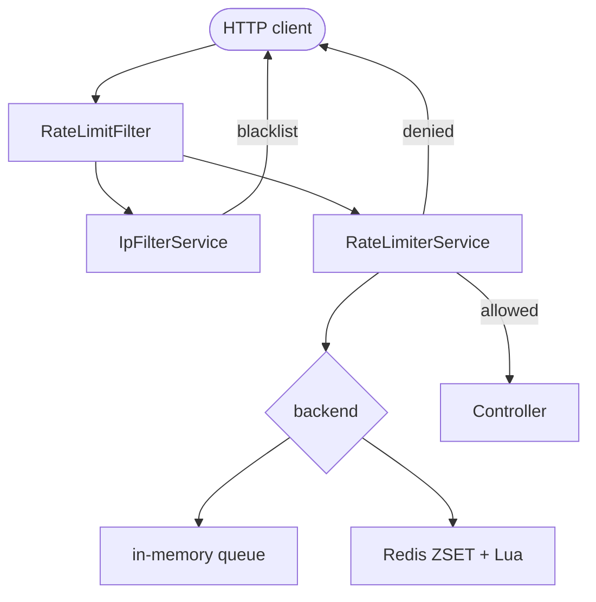

# api-rate-limiter

A small Spring Boot 3 library for API rate limiting. Add one annotation
to your controller, set a couple of properties, done. Runs in-memory by
default, or shares limits across JVMs when you turn Redis on.

[](./LICENSE)
[](https://openjdk.org/projects/jdk/17/)
[](https://spring.io/projects/spring-boot)

```java
@GetMapping("/search")
@RateLimit(limit = 30, timeWindowSeconds = 60, type = RateLimitType.IP_BASED)
public List<Hit> search(@RequestParam String q) { ... }
```

## Install

Java 17+, Spring Boot 3.2+ (tested on 3.4.4). Not on Maven Central yet;
until then, `./mvnw install` locally.

```xml
<dependency>
    <groupId>io.github.dhruvin-dhameliya</groupId>
    <artifactId>api-rate-limiter</artifactId>
    <version>0.1.0-SNAPSHOT</version>
</dependency>
```

Auto-config picks it up as soon as the jar is on the classpath. No
`@Enable...` needed.

## Quick start

Set a default in `application.properties`:

```properties
rate-limiter.default-limit=100
rate-limiter.default-time-window-seconds=60
```

Start the app. Every endpoint is now capped at 100 requests per minute
per client IP.

Override a single route with the annotation:

```java
@RateLimit(limit = 20, timeWindowSeconds = 60, type = RateLimitType.IP_BASED)
```

Put it on a method, or on a whole controller class.

## The annotation

| Attribute | Meaning |
|-----------|---------|
| `limit` | Max requests per window. |
| `timeWindowSeconds` | Window length in seconds. |
| `type` | How the bucket is keyed (see below). |
| `value` | Custom endpoint name; defaults to the method name. |
| `methods` | Restrict to specific HTTP methods; empty means all. |
| `key` | SpEL expression for a custom bucket key. |

### Types

| Type | Bucket per |
|------|-----------|
| `IP_BASED` | Client IP + endpoint |
| `USER_BASED` | Authenticated principal + endpoint |
| `API_KEY_BASED` | API key + endpoint |
| `METHOD_BASED` | HTTP method + endpoint |
| `ENDPOINT_BASED` | Endpoint only |
| `GLOBAL` | `global:<endpoint>` |

## Response

Allowed requests pass through. Denied ones get `429`:

```
HTTP/1.1 429 Too Many Requests
X-RateLimit-Limit: 20
X-RateLimit-Remaining: 0
Retry-After: 42
X-Trace-ID: 8f2c1a3b-...
```

```json
{
  "status": 429,
  "error": "Too Many Requests",
  "message": "IP-based rate limit exceeded. Please try again in 42 seconds.",
  "path": "/api/data",
  "timestamp": 1725782410123,
  "traceId": "8f2c1a3b-..."
}
```

`401` for a missing or invalid API key, `403` for a blacklisted IP.

## Configuration

The essentials:

```properties
rate-limiter.default-limit=100
rate-limiter.default-time-window-seconds=60

# IP allow / deny (exact-string match)
rate-limiter.enable-ip-filtering=true
rate-limiter.whitelisted-ips=127.0.0.1
rate-limiter.blacklisted-ips=203.0.113.7

# Per-IP burst detector
rate-limiter.ddos-protection-enabled=true
rate-limiter.ddos-threshold=1000
rate-limiter.ddos-ban-duration-seconds=3600

# Trust X-Forwarded-For only from these IPs (leave empty in dev)
rate-limiter.trusted-proxies=10.0.0.1

# Multi-node deployments
rate-limiter.enable-redis=false
```

Every property has an env-var form (`RATE_LIMITER_DEFAULT_LIMIT`, etc.)
and env vars win over property files.

Per-endpoint overrides live under `rate-limiter.endpoints.<name>.*`.
The `<name>` is the URI with the leading `/` stripped and other slashes
replaced with `-`, so `/api/v1/login` becomes `api-v1-login`:

```properties
rate-limiter.endpoints.login.limit=5
rate-limiter.endpoints.login.time-window-seconds=60
```

Precedence, first non-zero wins: env var, per-endpoint property,
annotation, default.

## Redis mode

For deployments with more than one JVM, flip one flag:

```properties
rate-limiter.enable-redis=true
spring.data.redis.host=redis.internal
```

The library swaps its in-memory queue for a Redis sorted set updated by
an atomic Lua script. Every node uses the same counters.

If Redis is unreachable the filter fails **open** so the app stays up.
Override `RateLimiterService` if you want it to fail closed instead.

## How it works

Sliding-window log. For each bucket the library keeps a queue of
request timestamps. On each request it drops timestamps older than the
window, then admits if the queue is shorter than the limit.

In-memory that queue is a `ConcurrentLinkedQueue`. On Redis it's a
ZSET, updated inside a Lua script so check-and-admit runs atomically.
`Retry-After` is the number of seconds until the oldest entry falls off
the window, rounded up.

## Architecture



Two enforcement points share the work. `RateLimitFilter` runs on every
request; it handles IP allow / deny plus `@RateLimit` on controllers.
`RateLimitAspect` handles `@RateLimit` on beans called outside a
request (scheduled jobs, listeners, tests). The filter sets a request
attribute after enforcing so the aspect never double-counts.

## Known limits

- Without Redis, counters are per-JVM.
- DDoS counters are per-JVM too. No shared-Redis version yet.
- IP allow / deny is exact-string match. No CIDR.
- API keys don't survive a restart unless you swap the storage bean.
- No Micrometer / metrics endpoint yet.

## Alternatives

Need burst smoothing? [Bucket4j](https://github.com/bucket4j/bucket4j).
Already on Spring Cloud Gateway? Use its
[`RequestRateLimiter`](https://docs.spring.io/spring-cloud-gateway/reference/spring-cloud-gateway/request-rate-limiter.html).
Want retry / circuit breaker alongside rate limiting?
[Resilience4j](https://resilience4j.readme.io/).

## Compatibility

Java 17+, Spring Boot 3.2+, Redis 6.2+ (if you use it).

## Contributing

See [`CONTRIBUTING.md`](./CONTRIBUTING.md) and the
[Code of Conduct](./CODE_OF_CONDUCT.md). For security issues:
[`SECURITY.md`](./SECURITY.md), please don't open a public issue.

## License

[MIT](./LICENSE) © 2025 Dhruvin Dhameliya
